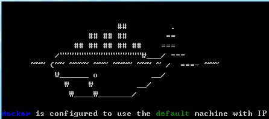
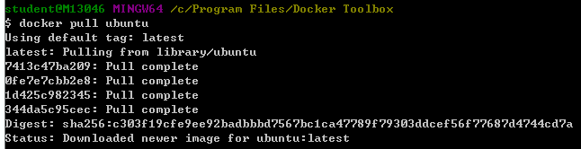
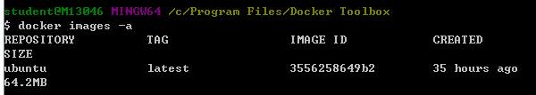
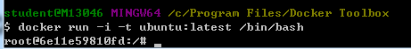
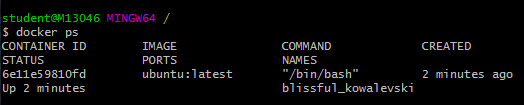
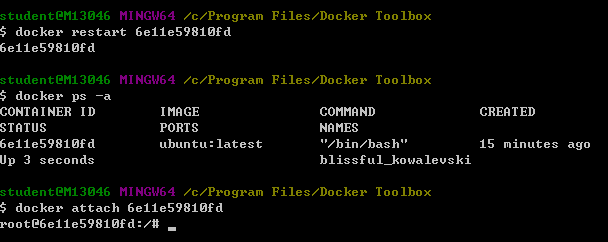
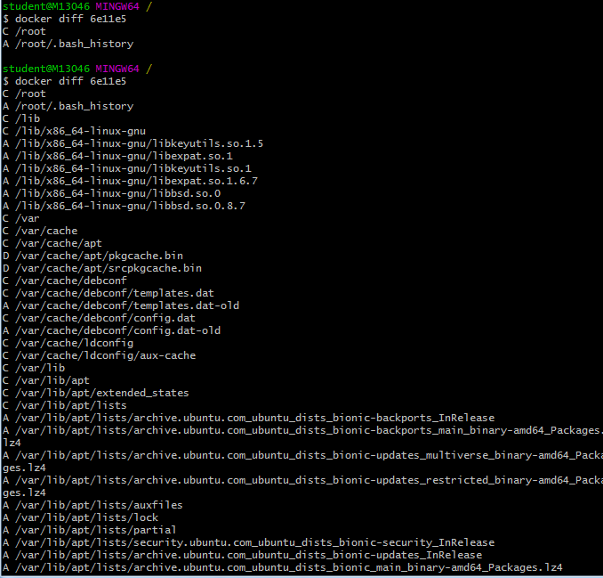
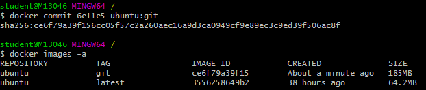
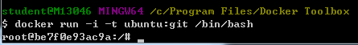
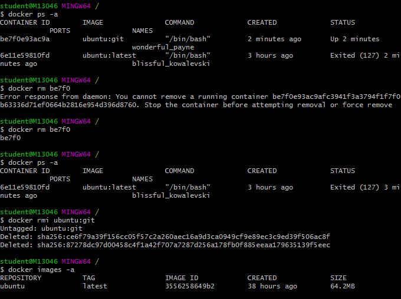

## Docker 시작기(for Window7)

### Situation

- 학원컴퓨터는 윈도우7, 내 노트북은 macOS. 운영체제가 다르다 보니 맥북에서 작업하던걸 학원컴퓨터에서 실행하고 작업하려니 생기는 문제점들이 많았다.

  처음에는 깃헙에 올리고 pull해서 쓰기만 하면 되겠지 싶었는데, 뭐가 뭔지 모를 에러가 나서 이럴 바에 도커를 시작해보자고 생각했다.

### 도커 툴박스 설치 및 이미지 pull

- docker for window가 있긴 하지만 윈도우 7에서는 사용할 수 없기 때문에, docker toolbox를 설치하였다. 설치하면 나름 귀여운 고래가 나온다.

  

- 시험 삼아 ubuntu 이미지를 pull 해보자. 4개의 이미지를 다운로드 받아 온다.

  

  `docker pull ubuntu`

* 그러나 `docker images -a` 하면 latest 버전의 ubuntu 이미지가 하나 존재한다.

### 컨테이너 생성, 삭제, 되살리기

- `docker run` 으로 이미지 쉘에 접근하기. 우분투에 접속하는데에 성공한다.

- 다른 터미널을 켜서 `docker ps` 명령어를 치면 현재 실행중인 컨테이너를 보여준다.

- 도커에 `exit` 을 하고 `docker ps`를 확인하면 컨테이너가 죽은 것을 알 수 있다. 그러나 `docker restart` 명령으로 되살릴 수 있으며, `docker attach`로 되살아난 컨테이너에 쉘을 다시 시행시킬 수 있다.

- 이렇듯 컨테이너는 되살아날 수 있지만, rm 명령으로 영영 종료시킬 수 있다. 애초에 run 할 때에 `--rm` 플래그를 주면, 컨테이너가 exit될 때 되살릴 수 없도록 삭제하라는 명령과 같다.

### 버전 관리 시스템(VCS)과 도커

- 이미지는 immutable하지만 컨테이너는 mutable하다. 특정 이미지로부터 생성된 컨테이너에 변경을 주고 이 변경 상태를 이미지로 만들어낼 수 있다. 버전 관리 시스템과 유사한 면이 많다.

- 컨테이너에 git을 설치해보자.

  `apt-get install -y git`

  그랬더니 unable to locate package git이라는 에러가 떴다. 이는 우분투 패키지 매니저인 apt-get을 업데이트 하지 않았기 때문. `apt-get update` 명령 후 다시 깃 설치를 시도하면 잘 된다.

* docker도 VCS처럼 `docker diff` 명령을 사용하면, 부모 이미지와 부모로부터 파생된 컨테이너의 파일 시스템 간 변경사항을 확인할 수 있다. 밑의 화면에서 첫번째 명령은 git을 설치하기 전, 두번째 명령은 컨테이너에 git을 설치한 후이다. 뭐가 엄청나게 생긴 것을 볼 수 있다.

- 그 다음 커밋 명령으로 이를 저장한다. `docker commit [컨테이너명] ubuntu:git` 한 뒤, `docker images -a` 를 통해 확인하면, git이라는 TAG가 붙은 새로운 이미지가 생성된 것을 볼 수 있다.

- 그리고 이 git이 설치된 우분투 이미지를 실행할 수 있다!

- 이제 이 이미지를 다시 삭제해보자. 해당 이미지를 삭제하려면, 그 이미지로부터 파생된 컨테이너가 모두 삭제되어야 한다. 종료로는 충분하지 않으므로 exit 후 rm해야 한다. rm은 컨테이너를 삭제하는 명령인 반면, rmi는 이미지를 삭제하는 명령이다.

### Dockerfile로 이미지 생성

- 도커파일이란 특정 이미지를 출발점으로 새로운 이미지 구성에 필요한 일련의 명령어들을 저장해놓는 파일이다.

- 도커파일은 직접 생성할 수도 있고, git에 올라와 있는 dockerfile을 clone해서 가져와도 된다. 일단 clone해서 가져온 경우, dockerfile이 존재하는 디렉토리로 이동해서

  `docker build -t [지정할 태그명] .`

  을 치면 된다. `.` 은 빌드 대상 디렉토리를 가리킨다. docker images -a 를 통해 확인하면 이미지가 새로 생성된 것을 확인할 수 있다.

- 이미지 생성 뒤에는

  `docker run -d -p [외부포트:내부포트] [이미지태그명]`

  으로 컨테이너를 생성하고 외부포트 주소를 쳐서 들어가 확인해보면 된다!
