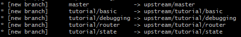

1.  일단 fork한 다음 **내 레포**로 간다. clone or download 버튼을 통해 주소를 복사한다.

2.  `git clone [내 레포 주소]`

    폴더를 만들고자 하는 위치에서 git clone을 해서 로컬 레포를 만든다.

3.  `cd [폴더 이름]`

    `git remote -v`

    해당 폴더로 이동한 뒤 remote 를 체크한다. 그러면 origin \[내 깃헙 레포 주소\] 이렇게 나올 것이다. 즉 포크해서 가져온 내 레포와 기본적으로 연결되어 있는 것이기 때문에 원래의 소스가 있는 레포랑 연결하려면 별도로 추가해주어야 한다.

4.  리모트에 upstream 추가

    `git remote add upstream [원래 소스 깃허브 주소]`

    포크해온 원래 소스가 있는 깃허브로 이동해서 주소를 복사한 뒤 위 명령어를 실행한다. 그러고 나서 다시

    `git remote -v`

    하면 origin뿐만 아니라 upstream이라는 이름으로 연결된 것을 볼 수 있다.

5.  업스트림의 변경 사항 가져오기

    `git fetch upstream`

    혹은 리모트 전체를 업데이트

    `git remote update`

    업스트림에 있는 변경사항을 로컬로 가져와 반영한다. 나의 경우 이렇게 브랜치가 새롭게 반영되었다.

    

6.  머지 혹은 리베이스로 합치기

    여러 개의 브랜치가 있는데 내가 여기서 가져오고 싶은 것은 업스트림의 tutorial/debugging 브랜치의 내용이다. 따라서 아래와 같이 머지한다. 여기서 주의할 점은 내가 머지하고자 하는 로컬 브랜치로 체크아웃한 상태여야 한다.

    `git merge upstream/tutorial/debugging`

    또는 리베이스 하려면 이렇게

    `git pull --rebase upstream tutorial/debugging`

7.  개인 브랜치에서 작업

8.  리모트에 푸시하기 전에 다시 한 번 동기화 -> 리모트 푸시

    이 때 개인 로컬 브랜치에 바로 땡겨오기 보다는, 로컬 tutorial/debugging으로 체크아웃한 다음 upstream tutorial/debugging을 pull한다. 그 다음, 로컬에서 내 브랜치와 tutorial/debugging을 머지해본다. 잘 합친 뒤 리모트 오리진에 푸시한다.

9.  PR

    이제 원래 소스가 있는 레포에다가 이것을 반영하고 싶으면 해당 브랜치로 풀리퀘를 날리면 된다. 내 레포에서 pull request를 클릭하고 pr를 날리고자 하는 브랜치를 잘 선택한 뒤 내용을 적고 날린다.
