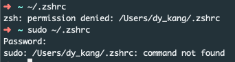

## .zshrc 파일 열기

### 문제

뭔가를 설치하고 나서 잘 설치되었는지 확인하기 위해서 명령어를 쳤을 때 쉘이 이를 인식하지 못하는 경우가 있다.

예를 들어 nvm을 설치하고 나서 nvm —version 했는데 command not found가 나오는 경우라든가.

그럴 때에는 .zshrc 파일(bash면 .bash_profile)에 스크립트를 추가해줘야 되는데 문제는 permission denied라며 .zshrc 파일이 안 열릴 때.

### 해결

방법은 간단하다. 그냥 에디터로 열면 된다! 나는 vscode를 사용하므로 `code ~/.zshrc` 를 쳤더니 에디터로 열렸다. 열어서 스크립트 추가 및 저장하고 터미널 다시 열었더니 nvm 명령어를 잘 인식하였다:)
