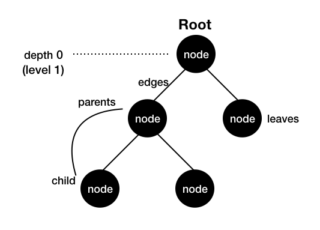

왜 이진 탐색 트리(Binary Search Tree, BST)인가? 

정렬된 배열에서의 검색은 이진 검색으로 하면 되므로 O(logN)으로 매우 빠르다. 단, 삽입과 삭제는 느리다. 정렬된 상태를 유지하려면 최악의 경우 N개의 원소를 시프트해야 하므로 O(N)만큼 걸린다. 

반면 해시테이블은 검색, 삽입, 삭제가 모두 O(1)이다. 하지만 정렬된 배열에 비교했을 때 순서를 유지하지 못한다는 큰 단점이 있다. 

그렇다면 정렬된 배열과 해시테이블의 장점을 모두 갖고 있는 자료구조는 없을까? __검색, 삽입, 삭제가 빠르면서도 순서를 유지할 수 있는 자료구조인 이진 탐색 트리__ 를 알아보자. 


## 1. 트리

이진 탐색 트리에 대해 알기 전에 트리, 이진 트리, 이진 탐색 트리를 구분할 필요가 있다. 단어에서 알 수 있듯이 트리가 가장 상위 개념이고, 이진 트리가 트리에 포함되며, 또한 이진 탐색 트리는 이진 트리에 포함되는 관계이다. 

그러면 각각에 대해 알아보자.

### 1-1. 트리의 구성요소



- 트리는 __노드__ 들로 이루어져 있다. 
- 각 노드를 잇는 선을 __간선(edge)__ 이라고 한다. 
- 루트 노드는 최상위 레벨에 있는 노드를 의미하며, 부모 노드가 없는 유일한 노드이다. 
- __루트 노드를 제외한 모든 노드는 단 하나의 부모 노드를 가진다.__ 
- 깊이(depth)란 루트 노드와 해당 노드 사이의 거리(=각 노드를 잇는 최소 간선 개수)를 의미한다. 
- 레벨(level)이란 루트 노드와 해당 노드 사이의 간선의 개수 + 1이다. (즉 depth +1임) 
- 잎새(leaf)란 자식이 없는 노드를 가리킨다.
- 높이(height)란 잎새 노드와 루트 노드 사이에 가장 긴 경로(path)에 있는 간선의 개수이다. 위 트리는 높이가 2이다.  

### 1-2. 트리의 특성

- 트리는 **회로(cycle)가 없다.**
- **임의의 노드에서 다른 노드로 가는 경로(path)는 유일하다.**
- 모든 노드는 서로 연결되어 있다. (다른 노드로 가는 path가 항상 존재한다) 

## 2. 이진 트리(Binary Tree)

이진 트리란 _자식 노드가 최대 2개_ 인 노드들로만 구성된 트리이다. 자식이 없거나, 하나 있거나, 2개까지 있을 수 있다. 이진 트리에는 정이진트리, _완전이진트리_, 균형이진트리 등이 있다. 

## 3. 이진 탐색 트리(Binary Search Tree)

이진 탐색 트리는 이진 트리의 특성을 가지므로 자식 노드가 최대 2개이다. 여기에서 더 나아가 이진 탐색 트리는 한 노드의 자식이 둘일 때, 

- 각 노드의 왼쪽 서브트리는 해당 노드보다 작은 값을 가진 노드로만 구성되어 있다. 
- 각 노드의 오른쪽 서브트리에는 해당 노드보다 큰 값을 가진 노드로만 구성되어 있다. 
- 왼쪽 서브트리, 오른쪽 서브트리 또한 이진탐색트리이다. 중복되는 노드는 없다. 

위 조건을 만족한다. 

### 3-1. TreeNode와 BST의 Initializer 구현

```python
# 트리 노드 구현
class TreeNode:
  def __init__ (self, val, left=None, right=None):
    self.value = val
    self.leftChild = left
    self.rightChild = right
```

```python
class BST:
  def __init__ (self, root=None):
    self.root = root
    self.size = 0
    if root:
      self.size = 1 
```

### 3-2. Search 메서드

```python
class BST:
	
  [...]
  
  # key는 찾고자 하는 값
  def search(self, key):
    return self._search(self.root, key)
  
  # node는 TreeNode의 인스턴스
  def _search(self, node, key):
    # 기저 조건
    if node is None or node.value == key:
      return node
    
    if node.value < key:
      return self._search(node.rightChild, key)
    else:
      return self._search(node.leftChild, key)
    
    return None   
```

여기서 `search` 메서드와 `_search` 메서드를 따로 쓴 것은 사용자 편의를 위해서다. 저렇게 재귀적으로 search 함수를 부르려면 node와 key를 받아야 하는데, 이를 그대로 쓰게 하면 이런 식이다. 

```python
import bst # 이진탐색트리 모듈 가칭
root = bst.TreeNode(1)
a = bst.BST(root)
a.search(root, 1)
a.search(root, 2)
```

즉, 검색 메서드를 쓸 때마다 root 노드를 인자로 같이 넘겨줘야 하니까 귀찮은 데다 보기에 깔끔하지 못하다. 그런데 `search` 메서드가 내부적으로 `_search` 메서드를 부르게끔 한다면, 검색할 키만 인자로 넘겨주면 된다. 

```python
import bst 
root = bst.TreeNode(1)
a = bst.BST(root)
a.search(1)
a.search(2)
```

코드 상에선 작은 차이지만 좀 더 깔끔하고 직관적인 느낌이 든다. 더 나아가 사용자가 일일이 트리노드 인스턴스를 불러 루트 노드를 만들고, 이를 다시 BST Initializer에 인자로 넘겨주는 것이 귀찮기 때문에, 값만 입력받은 다음 자동으로 루트 노드를 만들어 주면 더 간결해보일 것 같다. 

```python
class BST:
  def __init__ (self, root_value):
    self.root = None
    if root_value is None:
      raise ValueError("Root value is required")
    else:
      self.root = TreeNode(root_value)
      
    self.size = 1
```

그러면 search 메서드를 부를 때 이렇게만 하면 끝! 

```python
import bst
a = bst.BST(1) # 1은 루트 노드 data 값
a.search(1) # 1은 search 하고자 하는 key
```

사실 이렇게 재귀적으로 부르지 않고 loop를 사용하면 더 쉽긴 하다. 재귀로 부를 때처럼 굳이 search, _search 메서드를 나누지 않아도 요구되는 인자가 하나고, 구현 코드 가독성도 높다. 

```python
class BST:

  [...]

  # loop로 구현한 search  
  def search(self, key):
    temp = self.root
    
    while temp:
      if temp.value is key:
        return temp
      if temp.value > key:
        temp = temp.leftChild
      if temp.value < key:
        temp = temp.rightChild

    return None  
```


쓰다 보니 길어져서 insert, delete 메서드는 2편에 작성하기로😂

## 참고

- [ratsgo님의 블로그]([https://ratsgo.github.io/data%20structure&algorithm/2017/10/21/tree/](https://ratsgo.github.io/data structure&algorithm/2017/10/21/tree/))
- 「누구나 자료 구조와 알고리즘」 (제이 웬그로우 저, 길벗 출판)
- [위키피디아](https://en.wikipedia.org/wiki/Tree_(data_structure))

