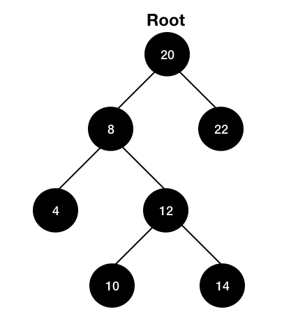

## 3. 이진 탐색 트리(Binary Search Tree)

### 3-1. 이니셜라이저

```python
# 트리 노드 구현
class TreeNode:
  def __init__ (self, val, left=None, right=None):
    self.value = val
    self.leftChild = left
    self.rightChild = right
```

```python
# BST의 이니셜라이저
class BST:
  def __init__ (self, root_value):
    self.root = None
    if root_value is None:
      raise ValueError("Root value is required")
    else:
      self.root = TreeNode(root_value)

    self.size = 1
```

### 3-2. [Search 메서드](https://alledy.netlify.com/posts/binary-search-tree-1/)

### 3-3. Insert 메서드

insert는 search와 매우 흡사하다. 다만 _이진탐색트리는 중복 노드가 있어선 안되므로_ search 메서드를 불러서 인서트하고자 하는 값을 가진 노드가 이미 있는지 한 번 확인한다.

- loop 버전

```python
class BST:

  [...]

  # loop로 구현
  def insert(self, key):
    # 중복 노드가 있는지 확인
    if self.search(key):
      raise ValueError("This key is duplicated with the existing node.")

    temp = self.root
    while temp:
      if temp.value > key:
        if temp.leftChild is None:
          temp.leftChild = TreeNode(key)
          self.size += 1
          break
        else:
          temp = temp.leftChild

      if temp.value < key:
        if temp.rightChild is None:
          temp.rightChild = TreeNode(key)
          self.size += 1
          break
        else:
          temp = temp.rightChild
```

- 재귀 버전

```python
class BST:

  [...]

  # 재귀로 구현
  def insert(self, key):
    if self.search(key):
      raise ValueError("This key is duplicated with the existing node.")
    return _insert(self.root, key)

  def _insert(self, node, key):
    temp = node
    if temp.value > key:
      if temp.leftChild is None:
        temp.leftChild = TreeNode(key)
        self.size += 1
      else:
        self._insert(temp.leftChild, key)

    if temp.value < key:
      if temp.rightChild is None:
        temp.rightChild = TreeNode(key)
        self.size += 1
      else:
        self._insert(temp.rightChild, key)
```

이렇게 작성하면 사용자가 사용할 때 아래처럼 쓸 수 있다.

```python
import bst # 이진탐색트리 모듈 가칭
a = bst.BST(1) # 1은 루트 노드의 값
a.insert(3)
a.insert(4)
```

### 3-4. Delete 메서드

사실 Delete가 가장 까다롭다. 삭제할 값을 찾는 것까지는 search와 같다. 하지만 삭제하고 나서 그 자리를 대체할 후계 노드를 찾는 것이 다소 까다롭다. 가능한 경우의 수는 자식의 개수에 따라 3가지이며, 각각의 경우 후계 노드로 대체하는 과정이 조금씩 다르다.

1. 삭제할 노드의 자식이 없는 경우(=삭제할 노드가 잎새 노드인 경우)

   해당 노드를 삭제한다.

2. 삭제할 노드의 자식이 하나인 경우

   삭제할 노드(B)의 유일한 자식이 후계 노드(C)가 되므로, 삭제할 노드(B)는 삭제해버리고 삭제 노드의 부모 노드(A)의 자식을 후계 노드(C)로 설정한다. 즉 A-B-C 순으로 부모 자식 관계일 때 B가 삭제할 노드라면 B를 삭제한 후 A의 자식을 C로 설정한다는 것이다.

3. 삭제할 노드의 자식이 둘인 경우

   `Inorder successor`를 찾아 그 값을 복사하여 삭제할 노드의 값으로 대입하고, `Inorder successor`였던 후계노드를 삭제한다.

자식이 없거나, 하나인 경우는 쉽다. 하지만 자식이 두 개인 경우에는 **중위순회 후계자(Inorder successor)**를 찾은 다음 삭제할 노드를 이 노드로 대체해야 한다.

> 중위 순회 후계자란 이진 트리를 중위 순회할 때 해당 노드의 바로 다음에 순회하는 노드를 가리킨다.
>
> 중위 순회란 왼쪽 > 루트 > 오른쪽으로 트리를 순회하는 방식이다.

예시를 들어보자.



위 이진탐색트리를 중위순회하려면

- 가장 왼쪽 노드인 4부터 시작한다.
- 왼쪽 > 루트 > 오른쪽 순이므로 4가 속한 서브트리(4-8-12)에서 루트 노드인 8로 간다.
- 그 다음 오른쪽을 탐색하는데, 여기서 중요한 것은 오른쪽에 또 다른 서브트리(10-12-14)가 있다는 것이다. 그러므로 해당 서브트리의 왼쪽노드인 10부터 다시 순회한다.
- 그 다음 서브트리(10-12-14)의 루트 노드인 12를 순회한다.
- 그 다음 서브트리(10-12-14)의 오른쪽 노드인 14를 순회한다.
- 이제 전체 트리의 왼쪽 서브트리를 모두 순회하였으므로, 루트 노드인 20을 순회한다.
- 그 다음 오른쪽 노드인 22로 순회한다.
- 전체 순서는 4-8-10-12-14-20-22 이다.

중요한 점은 서브트리가 있을 경우, 그 서브트리에서 다시 왼쪽-루트-오른쪽 순서로 순회해야 한다는 점이다. 즉 4-8-12가 아니라 4-8-10-12 순서라는 것을 주의해야 한다.

중위순회 후계자는 해당 노드 다음으로 중위순회하는 노드이므로, 노드 8을 삭제하고자 하면 후계 노드는 10이 되고, 12를 삭제하고자 하면 14가 후계 노드가 된다. 즉 **중위순회 후계자는 해당 노드의 오른쪽 서브트리에서 가장 작은 값**이다.

그러면 delete 메서드를 작성하기 앞서, 유틸리티 함수로 `inorder` 메서드와 `inorder_successor` 메서드를 만들자.

```python
class BST:

  [...]

  # BST가 중위순회하는 순서를 print하는 메서드
  def inorder(self):
    return self._inorder(self.root)

  def _inorder(self, node):
    if node is not None:
      self._inorder(node.leftChild)
      print(node.value, end= " ")
      self._inorder(node.rightChild)

  """중위순회 후계자를 리턴하는 메서드
  해당 노드의 오른쪽 서브트리에서 가장 작은 값이므로
  오른쪽 자식의 가장 왼쪽 자식을 리턴
  """
  def inorder_successor(self, node):
    return self.min_value_node(node.rightChild)

  def min_value_node(self, node):
    if node.lefChild:
      return self.min_value_node(node.leftChild)
    return node
```

`inorder` 메서드는 노드의 삭제나 삽입에 따라 달라질 수 있는 순회 순서를 print하기 위한 것이고, `inorder_successor` 는 삭제하고자 하는 노드의 후계 노드를 리턴하는 메서드이다. **삭제하고자 하는 노드의 자식이 2개일 때에만 호출한다.**

```python
class BST:

  [...]

  # key값을 가진 노드를 삭제
  def delete(self, key):
    self.root = self._delete(self.root, key)

  # _delete 메서드는 새로운 루트 노드를 리턴
  def _delete(self, node, key):
    # 노드 밸류가 찾는 값과 일치할 때
    if node.value is key:
      """노드의 자식이 2개인 경우
      inorder_successor 메서드를 호출해 후계 노드를 찾는다.
      찾은 후계 노드의 value를 복사한다.
      원래 후계 노드는 삭제해버린다.
      후계 노드 값을 복사한 노드를 리턴한다.
      """
      if node.rightChild and node.leftChild:
        successor = inorder_successor(node)
        node.value = successor.value
        successor = None
        return node
      """노드의 자식이 1개인 경우
      후계 노드는 유일한 자식이 되므로
      노드는 삭제해버리고 자식(후계 노드)를 리턴한다.
      """
      elif node.leftChild or node.rightChild:
        node = None
        return node.leftChild or node.rightChild
      """노드의 자식이 0개인 경우
      후계 노드가 존재하지 않으므로 노드를 삭제한 후 리턴한다.
      """
      else:
        node = None
        return node

    """노드 밸류가 key와 일치하지 않을 때
    key와 대소비교를 통해 다시 _delete 메서드를 재귀적으로 호출한다.
    다만 여기서 재귀적으로 호출한 결과를 어디에 대입하고 있느냐가 중요하다.
    """
    else:
      if node.value > key:
        node.leftChild = self._delete(node.leftChild,key)
      if node.value < key:
        node.rightChild = self._delete(node.rightChild,key)
     	return node
```

이 delete 메서드를 이해하는 데 가장 시간이 오래 걸렸다. 내가 어려웠던 포인트는 다음과 같다.

> delete 메서드를 호출할 때 왜 self.root에 \_delete에서 리턴한 노드를 대입할까?

루트 노드를 삭제할 가능성이 있기 때문이다. 다른 노드를 삭제한다고 전체 트리의 루트 노드가 바뀌진 않는다. 하지만 루트 노드가 삭제되는 경우 전체 트리의 루트를 새로운 노드로 대체해야 하므로 \_delete 메서드에서 새로운 루트 노드를 리턴하도록 구현한다. 물론 삭제되는 노드가 루트가 아닌 경우에는 기존의 루트 노드를 리턴한다.

> \_delete 메서드 내에서 search 메서드를 활용하면 안 될까?

어차피 삭제 프로세스에는 삭제할 노드를 찾는 것이 선행돼야 한다. 그래서 처음에는 search를 활용하면 좋을 것 같았지만 search를 써서 구현하려다 보니 문제가 생겼다. search는 depth가 깊어지는 방향으로만 진행하면서 값을 찾기만 하면 되므로 찾고자 하는 노드의 부모에 대해 알 필요가 없다.

그런데 delete에서 삭제할 노드를 찾는 것은, 단순히 그 값을 가진 노드를 찾을 뿐만 아니라 _그 노드의 부모도 알고 있어야 한다._ 왜냐하면 결국 삭제는, 삭제할 노드의 부모의 자식을 새로운 노드로 설정하는 것이기 때문이다. 즉 A-B가 부모자식 관계이고 B가 삭제할 노드라면 이 B를 삭제한 후 새로운 후계 노드(C)를 자식으로 설정하여 A-C로 만드는 것이다. 그래서 부모 노드(A)를 알고 있어야 하는데 _search에는 부모 노드를 알 필요가 없으므로 그런 부분이 구현되어 있지 않다._ (단, 이것은 Singly linked list를 가정했을 때의 이야기다)

삭제 알고리즘은 인자로 전달된 node 값과 key가 일치하는 경우와 일치하지 않는 경우로 크게 나뉜다. 일치하지 않는 경우는 key와 대소비교를 해서 왼쪽 또는 오른쪽 자식을 다시 인자로 전달하여 재귀적으로 호출한다. search와 비슷하지만 다른 점은 그렇게 리턴된 값을 `node.leftChild` 혹은 `node.rightChild`에 대입하고 있다는 점이다. **여기서 node는 부모 노드(A)가 된다.** 그리고 그 부모 노드의 왼쪽 혹은 오른쪽 자식에 \_delete에서 리턴된 결과를 대입한다. 재귀적으로 호출을 하다보면 결국 어느 순간 key와 일치하는 노드를 찾고, 그 if 분기에서 후계 노드(C)를 리턴하게 된다. 그러니까 A의 자식을 후계 노드(C)로 새로이 설정하게 되는 것이다.

나도 이해하며 애를 먹었던 부분이라 길게 적게 되었는데 다시 한 번 느끼지만 이해한 것을 명확히 말이나 글로 설명하는 일은 참 어려운 것 같다.😵 멀고도 험한 자료구조의 길...😇

## 참고

- [GeeksforGeeks - BST delete](https://www.geeksforgeeks.org/binary-search-tree-set-2-delete/)
- [GeeksforGeeks - Inorder successor](https://www.geeksforgeeks.org/inorder-successor-in-binary-search-tree/)
