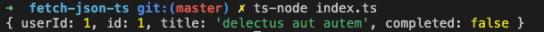
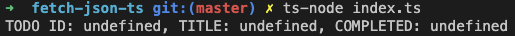
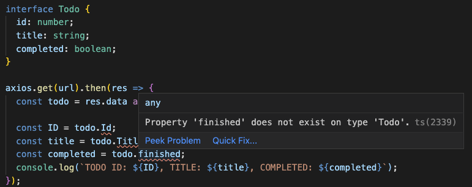

주로 [Udemy 타입스크립트 강의](https://www.udemy.com/course/typescript-the-complete-developers-guide) 를 듣고 정리한 내용이며 개인적으로 구글링한 내용도 포함돼 있다.

## 타입스크립트의 특징

- 오픈소스 프로그래밍 언어(from Microsoft)

- Typed \*superset of JavaScript

  _superset: A programming language that contains all the features of a given language and has been expanded or enhanced to include other features as well._

  그러니까 TS는 JS의 모든 feature를 포함할 뿐만 아니라 더 확장된 feature를 포함한다는 것.

- 타입스크립트로 작성된 코드는 플레인 자바스크립트로 컴파일된다.

- 커피스크립트와 달리 _extended JavaScript_

  커피스크립트는 자바스크립트가 아닌 새로운 다른 언어지만, 타입스크립트는 .ts확장자를 .js로 바꿔도 사용할 수 있다.

- 자바스크립트와 달리 타입 서포트를 해주기 때문에 컴파일 시 에러를 미리 잡을 수 있음(매우 장점)

- 타입 지정은 optional해서, 타입 지정을 하지 않더라도 타입스크립트가 타입을 추론해서 에러를 알려준다(물론 optional 하지 않게도 설정할 수 있다)

- 향상된 IDE 서포트

  Intellisense가 잘 돼있다. (매우 장점2)

## 타입스크립트 실행 방식

타입스크립트의 특징과 실행 과정을 보여주기 위해서 아주 간단한 앱을 만들어 보자. 먼저 타입스크립트를 설치한다.

```shell
# ts-node도 같이 전역 설치를 해준다
$ npm install -g typescript ts-node
```

그 다음 실습을 할 폴더를 만들고 package.json을 만들어 준다. 그리고 json fetch를 위해 axios도 깔아준다.

```shell
$ mkdir fetch-json-ts # 실습용 앱 디렉토리 생성
$ cd fetch-json-ts
$ npm init -y # package.json 및 node_modules 생성
$ npm install axios
```

그 다음 루트디렉토리에 index.ts 파일을 만들고 아래처럼 쓴다.

```typescript
import axios from 'axios'

const url = 'https://jsonplaceholder.typicode.com/todos/1'

axios.get(url).then(res => {
  console.log(res.data)
})
```

fake api를 요청해서 data를 받아오고 console에 찍어보는 간단한 작업이다. 문제는 이 코드를 실행시키는 것인데, TS는 JS가 아니기 때문에 브라우저가 노드(JS 런타임)에서 작동하지 않는다. 그러므로 **TS를 먼저 JS로 컴파일하고, 컴파일된 JS를 런타임에서 실행하는 과정을 거쳐야 한다.**

```shell
$ tsc index # 타입스크립트 컴파일러(tsc)로 index.ts 컴파일하기
$ node index # 컴파일 결과 생성된 index.js를 노드에서 실행하기
```

tsc로 인덱스 파일을 컴파일하면(여기선 확장자 생략 가능) 같은 이름의 js 파일이 생성된다. 즉 index.ts를 플레인 자바스크립트로 컴파일한 것이다. 이제 이 자바스크립트 파일을 node에서 실행하면, 터미널에 fetch 결과가 나타난다.

단 이렇게 하면 컴파일 -> 노드 실행 이라는 2단계를 거쳐야 하는데, ts-node를 쓰면 한 번에 할 수 있다.

```shell
$ ts-node index.ts # 여기선 확장자를 써주어야 한다.
```

결과는 이렇게 객체 형태로 리턴된다.



이제 출력 형식을 바꿔보고자 한다. res.data를 todo라는 변수에 저장하고 출력하고자 하는 프로퍼티를 각각 변수에 저장하여 출력한다.

```typescript
import axios from 'axios'

const url = 'https://jsonplaceholder.typicode.com/todos/1'

axios.get(url).then(res => {
  const todo = res.data
  // 일부러 잘못된 키로 접근
  const ID = todo.Id
  const title = todo.Title
  const completed = todo.finished
  console.log(`TODO ID: ${ID}, TITLE: ${title}, COMPLETED: ${completed}`)
})
```

이 때 일부러 todo 객체에 잘못된 키로 접근하여 변수에 저장해본다. 하지만 IDE 상에서는 에러가 뜨지 않고 컴파일도 정상적으로 된다. 다만 아래처럼 undefined를 출력한다.



만약 실수로 잘못 입력한 경우에도 IDE 상에서 에러나 경고가 뜨지 않고, 컴파일도 정상적으로 된다면 결과를 보기 전까지 에러를 잡아낼 수 없다. 하지만 **타입스크립트의 인터페이스**를 활용한다면 이런 일을 방지할 수 있다.

```typescript
// Todo의 인터페이스
interface Todo {
  id: number
  title: string
  completed: boolean
}

axios.get(url).then(res => {
  const todo = res.data as Todo

  const ID = todo.Id
  const title = todo.Title
  const completed = todo.finished
  console.log(`TODO ID: ${ID}, TITLE: ${title}, COMPLETED: ${completed}`)
})
```

**객체가 어떤 프로퍼티나 메소드를 가질 지 미리 선언하는 것이 인터페이스이다.** 위 코드에서는 Todo 객체가 id, title, completed라는 세 개의 프로퍼티를 가질 것이며 각 prop의 타입이 어떻게 되는지를 선언하였다. 그리고 response 데이터에 `as Todo` 를 붙여 Todo 타입으로 **\* 타입 단언(Type Assertion)**한다.

`*` _타입 단언은 프로그래머가 수동으로 컴파일러에게 특정 변수에 대한 타입 힌트를 주는 방식이다. 적절하게 사용하면 타입스크립트가 타입 추론을 잘못하는 경우를 교정할 수 있지만 `as any` 와 같은 식으로 남발되면 타입스크립트를 사용하는 이유가 없어진다. 이 경우에는 간단한 예제를 만들기 위해 사용되었다._

코드를 수정하고 나면 빨간 줄로 에러가 표시되는 것을 볼 수 있다.



타입 Todo에는 존재하지 않는 프로퍼티라는 에러가 표시되므로, 프로그래머는 실수를 했더라도 코드 작성 단계에서 고칠 수 있게 된다.

그리고 콘솔 로그를 출력하는 함수를 만들 때도 타입 Todo를 활용하면 같은 이점을 누릴 수 있다.

```typescript
interface Todo {
  id: number
  title: string
  completed: boolean
}

axios.get(url).then(res => {
  const todo = res.data as Todo

  logTodo(todo)
})

// 인자를 ID, title, completed 이렇게 개별적으로 전달하면
// 인자를 넣는 순서가 실수로 잘못될 수도 있고
// 인자 개수가 너무 많으면 일일이 쓰기 번거로울 수도 있다
// 이 때 사전에 정의한 인터페이스를 타입으로 활용하면
// 타입스크립트가 프로퍼티를 추론해준다
const logTodo = (todo: Todo) => {
  const ID = todo.id
  const title = todo.title
  const completed = todo.completed
  console.log(`TODO ID: ${ID}, TITLE: ${title}, COMPLETED: ${completed}`)
}
```
