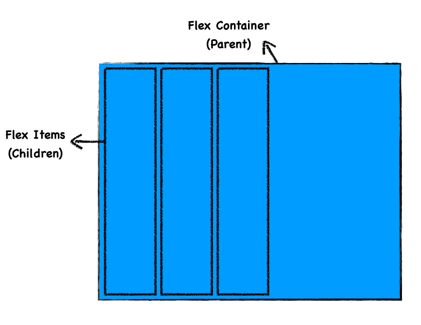
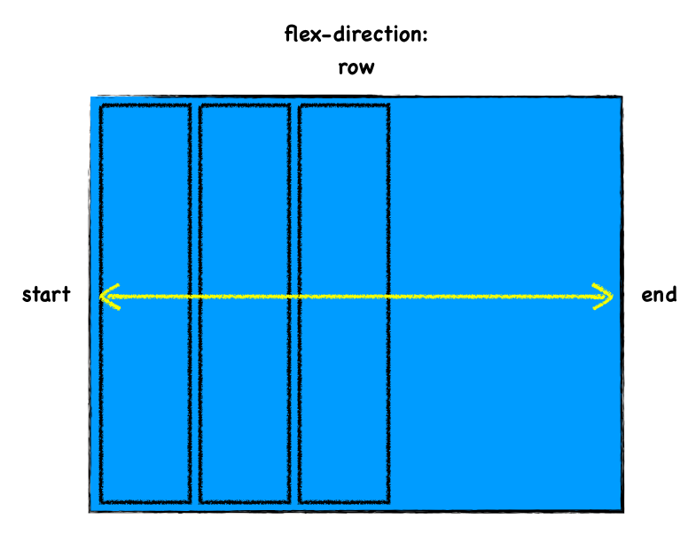
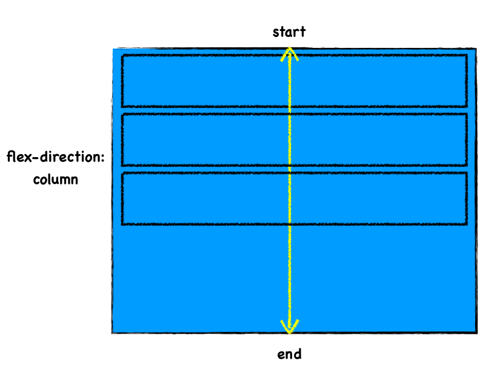
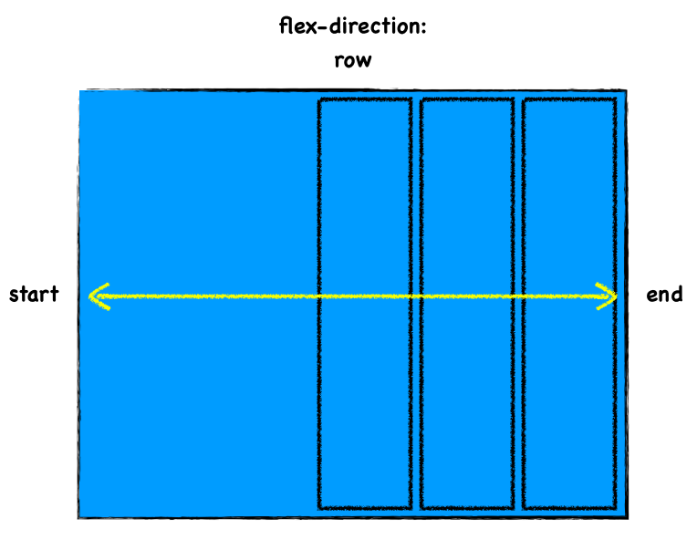
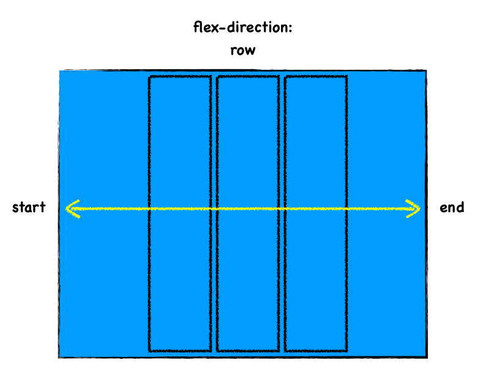
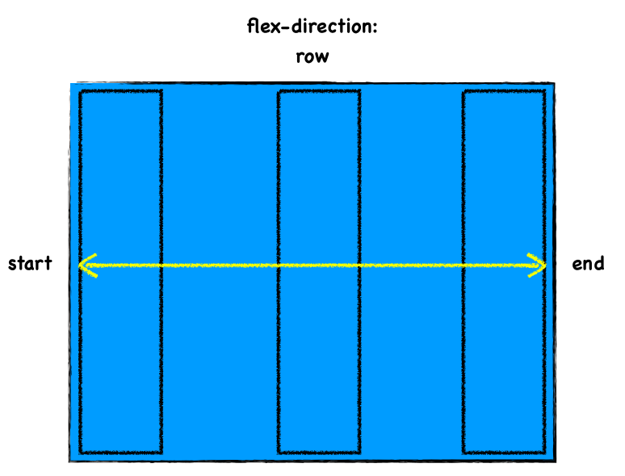
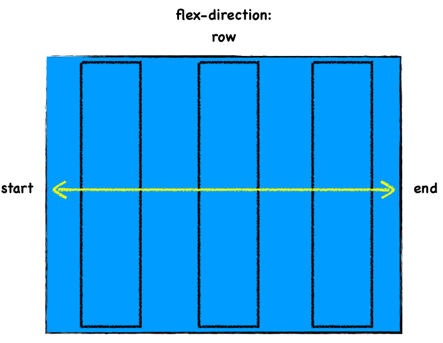
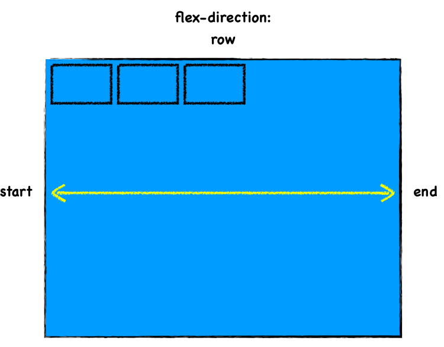
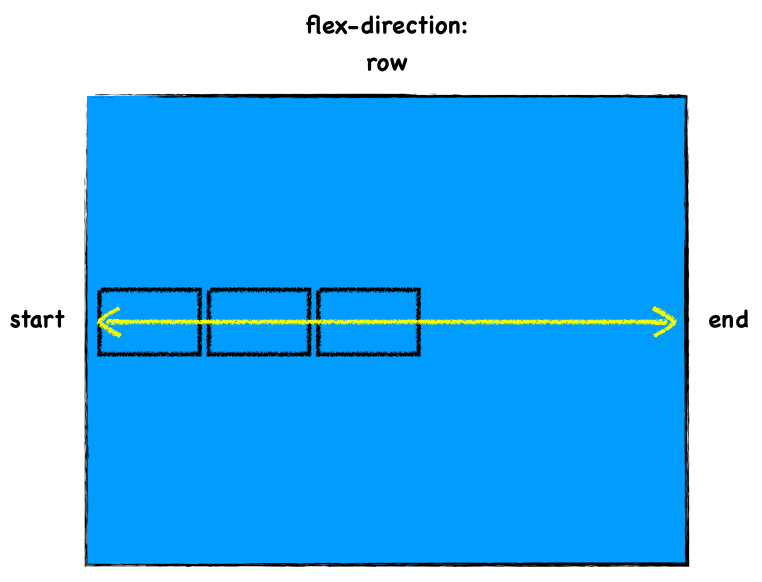

CSS로 레이아웃을 짤 때 반응형 웹을 만들기 위해 많이 사용되는 것이 Flexbox이다. Grid도 있지만 아직은 Grid를 지원하지 않는 브라우저가 좀 더 많고, Flexbox가 더 간단하기 때문에 복잡하지 않은 레이아웃을 짤 때에는 효율적이고 쉽게 사용할 수 있다.

이번에 웹 페이지의 레이아웃을 처음부터 마크업하면서(부트스트랩과 같은 프레임워크를 사용하지 않고) 내가 얼마나 CSS를 잘 모르고 있었는지 알게 됐다. 그래서 간단하게 플렉스박스에 대해서 오해하고 있었던 부분을 정리하고자 한다.

## Flexbox의 구조

플렉스박스는 부모와 자식으로 나누어서 생각한다. 부모는 커다란 컨테이너, 자식은 그 속에 위치한 아이템들이다. 부모와 자식이 사용하는 속성이 다르기 때문에 이 개념을 잡고 있어야 한다.

## 컨테이너 속성

먼저 부모(컨테이너)가 사용하는 중요한 개념은 이렇다.

- `display: flex;`
- `flex-direction` → `row or column;`
- `justify-content`
- `align-items`

이 외에도 align-content라던가 flex-wrap 등도 있지만 일단 제일 중요한 속성들은 이것이다.

_일단 flex 컨테이너임을 명시하기 위해서 display 속성에 flex를 준다._ 그러면 이 컨테이너의 자식들에게 flex를 적용할 수 있게 되는 것이다.

그 다음 _flex-direction은 flex의 메인 축(Main Axis)를 정한다._ flex-direction는 row 또는 column 값을 가지는데, 디폴트값은 row이므로 display를 flex로 주고 direction은 따로 적지 않으면 자동으로 row가 메인 축이 된다.

### 메인 축이 row일 때

### 메인 축이 column일 때

내가 처음에 오해했던 점은 명칭에서 생긴 오해였다. 메인 축이 row라면, 컨테이너 내부의 flex item들이 row로 쌓이는 형태일 줄 알았던 것이다. 하지만 그림에서 볼 수 있듯이, 메인 축이 row이면 item들은 column의 형태가 되고, 반대로 메인 축이 column이면 item들은 row 형태로 쌓인다. _즉 메인 축의 이름과 item들이 쌓이는 형태는 반대라고 생각하면 된다._

### justify-content

이 속성은 **메인 축을 따라 아이템들이 어떻게 정렬될지**에 관한 값이다. 메인 축을 따라서 움직인다는 게 중요하다. 스튜디오밀 님의 강의에서 쓰시는 표현을 빌려오자면, 이게 꼬치같다고 생각하는 것이다. (떡꼬치를 생각해보자. 메인 축은 꼬치가 되고 아이템들은 떡이다.) 가령 flex-direction이 row일 때, 떡꼬치의 떡들이 start 쪽에 꽂혀져 있다. 이것은 사실 `justify-content`의 디폴트 값이 `flex-start`라는 값이기 때문이다.

만약에 `justify-content`에 `flex-end` 값을 주면, end 쪽으로 떡들이 꼬치를 따라 이동한다.

만약 `center`로 주면 꼬치의 가운데에 떡들이 위치한다.

이 외에도 `space-between`, `space-around` 등이 있는데 `space-between`은 축을 따라 양 끝에 아이템들이 붙고, 그 다음 일정한 간격으로 space를 두고 정렬되는 형태이다.

`space-around`도 일정 간격을 두고 정렬되는 것은 같지만 between이 양 끝에 아이템이 정렬된 것과는 다르게 around는 각 아이템의 margin을 동일하게 준다. 예를 들어 디렉션이 row일 때 좌우 margin을 item에게 동일하게 10px씩 주는 것을 생각해보자. 양 끝의 아이템들은 컨테이너에서 10px만큼 떨어진 곳에 위치할 것이고, 그 사이 사이의 아이템들은 각각 10px을 합쳐 20px만큼의 간격을 두고 정렬될 것이다.

디렉션이 column인 경우도 마찬가지로 꼬치(축)을 따라서 위 아래로 움직인다고 생각하면 된다.

### align-items

align-items는 축과 cross되는 방향으로 움직이는 정렬이다. 예컨테 메인 축이 row면 column 축을 따라 움직이는 속성을 주는 것이다.

플렉스 디렉션이 row, 고 `justify-content`도 `flex-start`일 때 (즉 flex의 기본값) `align-items`에 `flex-start`를 주면 이렇게 된다.

길쭉하던 떡들이 위로 착 붙는다. 애초에 떡들이 길쭉했던 것은 `align-items`의 디폴트 값이 `stretch`라는 값이었기 때문이다. 해다 아이템이 갖고 있는 콘텐츠의 길이가 짧든 길든 일단 컨테이너의 높이 만큼 아이템을 늘리고 보는 게 `stretch`이다. (단, 각 아이템들이 고정 height를 가지고 있지 않다는 전제 하에서)

그런데 `flex-start`를 주면 메인 축의 교차축인 column의 start방향으로 정렬된다. 이 때 콘텐츠가 갖고 있는 크기만큼 줄어든다. 위 그림에서는 예시로 똑같이 그려놓은 것뿐이다.

center 값을 주면 교차축의 방향에서 중간에 정렬된다.

즉, 축의 방향만 교차축으로 달라질 뿐 `justify-content`와 매우 비슷하다. 가질 수 있는 값도 거의 비슷하지만 다른 부분도 있기는 하다. 자세한 것은 참고 링크로.

생각보다 사진이 들어가다보니 길어져서 아이템들의 속성은 나누어서 올려야겠다.

## 참고

[css-tricks](https://css-tricks.com/snippets/css/a-guide-to-flexbox/)
